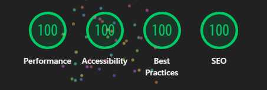

# avel

<p></p>

**The fastest-rendering [Zola](https://www.getzola.org/) blog theme.** A homage to the legendary [Abe Hiroshi's homepage](http://abehiroshi.la.coocan.jp/) — the page that renders before you blink — rebuilt as a modern, responsive, fully customizable theme.

- **Instant display** — pure HTML streamed top-to-bottom; the first characters paint immediately, nothing waits on a wrapper to finish loading
- **Instant navigation** — internal links are prerendered on hover (Speculation Rules) and cross-faded with CSS View Transitions; clicking feels like ~0ms
- **No runtime JavaScript, zero external resources** by default (no web fonts, no CDN; the only `<script>` tags are declarative data — JSON-LD structured data and a Speculation Rules hint — never executed code, and both can be switched off)
- **Inline critical CSS** — no render-blocking external stylesheet request
- **`content-visibility` for off-screen content** — long lists/articles skip rendering until scrolled into view, while on-screen text still paints instantly
- **Responsive** — Abe's site isn't; avel is (one CSS media query, no JS)
- **SEO out of the box** — canonical URL, Open Graph, Twitter Card, JSON-LD structured data, sitemap and feed autodiscovery, all emitted by default with zero runtime JS
- **Optional no-JS comments** — show a per-post Nostalgic BBS image that opens the interactive posting page only when clicked
- **Syntax-highlighted code** — build-time highlighting with inline styles (no JS, no extra request)
- **Automatic dark mode** — follows `prefers-color-scheme` with CSS only; set `dark_mode = false` to stay always-light
- **Content organization** — tags, a year-grouped archive, tag-based related posts, and prev/next post navigation
- **Custom 404 page and favicon** (favicon overridable via config)
- **Lazy-loaded content images**, eager LCP image with `fetchpriority`
- **Fully customizable** via `config.toml` — defaults recreate the Abe look, every knob is overridable, no HTML/CSS editing needed

## Demo

[avel.llll-ll.com](https://avel.llll-ll.com)

## Installation

```bash
cd your-zola-site
git submodule add https://github.com/kako-jun/avel themes/avel
```

Set in `config.toml`:

```toml
theme = "avel"
```

## Configuration

All style options are controlled via `[extra]` in `config.toml`. Copy and uncomment what you need:

All defaults recreate the Abe Hiroshi look. Uncomment any line to override it.

```toml
[extra]
# --- Profile (shown centered in the top-page content, like Abe's right frame — not in the sidebar) ---
# name = "Your Name"
# profile_image = "me.webp"       # place in static/
# profile_text = "one-line bio"   # optional, under the name

# --- Background ---
# background_image = "bg.svg"     # place in static/
# body_bg = "#ffffff"

# --- Layout ---
# nav_width = "18%"               # default: 18% (Abe's frameset is cols=18,82)
# nav_bg = "#f0f0ff"              # default: #f0f0ff (pale lavender)
# nav_border = true               # default: true (right divider, a nod to the old frame border)
# nav_item_gap = "1.3em"          # default: 1.3em
# nav_bullet = "●"                # default: ● (set "" to remove)
# nav_bullet_colors = ["#ffcccc","#00ff00","#33ffff","#0099ff","#0000ff","#333399","#cc00cc"]  # default: Abe's 7-color cycle
# main_padding = "1em"
# max_width = "960px"
# content_align = "left"         # left / center / justify
# title_align = "center"          # page <h1> alignment, default: center
# line_height = "1.5"            # default: 1.5

# --- Font ---
# font = "sans-serif"             # serif / sans-serif / monospace, default: sans-serif (Abe is unstyled, so it shows the browser default — gothic for Japanese)
# font_family = "Georgia"         # system fonts only = no external requests
# google_fonts_url = "https://fonts.googleapis.com/css2?family=Noto+Serif+JP&display=swap"
# font_size = "16px"              # default: 16px (browser default)

# --- Colors ---
# text_color = "#000000"          # default: black
# link_color = "#0000ee"          # default: browser-default blue
# link_visited = "#551a8b"

# --- Speed (modern, on by default — keeps Lighthouse 100) ---
# view_transitions = true         # CSS cross-document fade between pages (no JS)
# speculation_rules = true        # prerender internal links on hover for ~0ms navigation (one declarative <script>; external links and /atom.xml excluded)

# --- Date ---
# date_format = "%Y-%m-%d"        # e.g. "%Y年%m月%d日"

# --- Nostalgic BBS comments (no JS on article pages; click the image to post) ---
# nostalgic_bbs = false
# nostalgic_bbs_limit = 3
# nostalgic_bbs_width = 760
# nostalgic_bbs_label = "Comments"
# nostalgic_bbs_hint = "Click to comment"

# --- Footer ---
# footer = "© Your Name"

# --- SEO / OGP (canonical, Open Graph, Twitter Card, and JSON-LD are emitted by default) ---
# og_image = "og.webp"            # OGP/Twitter card image, place in static/ (output as an absolute URL)
# twitter = "@yourhandle"         # twitter:site handle for Twitter Cards

# --- Navigation ---
# nav = [
#   { label = "Home", url = "/" },
#   { label = "Posts", url = "/posts/" },
# ]
```

## Content structure

```
content/
  _index.md              # top page (template = "index.html")
  posts/
    _index.md            # posts section (sort_by = "date", paginate_by = 20)
    my-post.md           # a post
  archive.md             # year-grouped archive (template = "archive.html", weight = 1)
```

The top page pulls the latest posts directly via `get_section()` in `index.html`, so no `transparent` flag is needed on `posts/_index.md`.

Prev/next post links at the bottom of each post follow the section's `sort_by` order. `sort_by = "date"` is recommended: without `sort_by` the links are not rendered, and with `weight` the left/right direction no longer means older/newer.

## Nostalgic BBS comments

avel can show a per-post [Nostalgic BBS](https://nostalgic.llll-ll.com/bbs) image below the share links. Article pages stay JavaScript-free; clicking the image opens Nostalgic's interactive BBS page where visitors can post.

Enable rendering:

```toml
[extra]
nostalgic_bbs = true
nostalgic_bbs_limit = 3
nostalgic_bbs_width = 760
nostalgic_bbs_label = "Comments"
nostalgic_bbs_hint = "クリックで書き込めます"
```

For per-post provisioning, set `NOSTALGIC_TOKEN` in the build environment and run:

```bash
npm run sync:nostalgic-bbs
zola build
```

Cloudflare Pages can use:

```bash
npm run sync:nostalgic-bbs && zola build
```

The sync script looks up or creates one BBS per final post URL (`base_url` + article path) and writes the returned public ids to `data/nostalgic_bbs.toml`, keyed by the article URL path.

```toml
[posts]
"/posts/my-post/" = "my-post-bbs-id"
```

Existing ids in this generated mapping are reused, so repeated builds do not call Nostalgic for every article. New posts are looked up with Nostalgic BBS `batchLookup` by their final permalink URL, then only missing BBS entries are created. If `NOSTALGIC_TOKEN` is not set, the script leaves the existing mapping untouched and skips missing posts, so ordinary theme builds still work.

The generated `data/nostalgic_bbs.toml` may be committed for stable local builds, or generated only in the deployment environment. In either case, never put `NOSTALGIC_TOKEN` in front matter, templates, or generated HTML. If you need to pin an existing BBS manually, edit this mapping file rather than individual post Markdown.

`batchLookup` accepts up to 1000 URLs per request. Nostalgic handles any lower-level D1 query chunking internally, so avel does not split requests just to satisfy SQLite bind limits.

## Using the auto comment section with any Zola theme

The Nostalgic BBS comment block is an independent component that works with any Zola theme. You do not need to modify the theme itself. Follow these four steps to embed per-post comment sections without adding JavaScript to your article pages.

**Prerequisites:** Nostalgic is free and requires no account sign-up. Choose any 8–16 character string as your token. See [nostalgic.llll-ll.com](https://nostalgic.llll-ll.com) for details.

> **avel users:** If you are using avel as your theme, this is already set up. Just set `nostalgic_bbs = true` in your `config.toml` and run `npm run sync:nostalgic-bbs` before building. No further steps are needed.

### Step 1 — Copy the sync script

Copy `scripts/sync-nostalgic-bbs.mjs` from this repository into your own site's `scripts/` directory. Then change your build command to run the script before Zola:

```bash
node scripts/sync-nostalgic-bbs.mjs && zola build
```

For Cloudflare Pages (or any CI environment), set the same command as the build command in the dashboard.

The script scans `content/posts/` by default. If your posts live in a different directory, set the `NOSTALGIC_CONTENT_DIR` environment variable:

```bash
NOSTALGIC_CONTENT_DIR=content/articles node scripts/sync-nostalgic-bbs.mjs && zola build
```

### Step 2 — Set the token as an environment variable

The script reads `process.env.NOSTALGIC_TOKEN`. **Never commit the token to your repository.**

For local builds, set it in your shell:

```bash
export NOSTALGIC_TOKEN=your-token-here
```

For Cloudflare Pages or other CI environments, add `NOSTALGIC_TOKEN` as an environment variable in the project settings.

If `NOSTALGIC_TOKEN` is not set, the script keeps any existing BBS ids intact and exits without creating new entries. Posts that already have a BBS id will continue to show their comment section; only new posts without an id are skipped.

### Step 3 — Add settings to `config.toml`

Only `nostalgic_bbs = true` is required. The other four keys are optional — the template snippet provides defaults for all of them.

```toml
[extra]
nostalgic_bbs = true
nostalgic_bbs_limit = 3          # number of recent comments shown in the image (optional, default 3)
nostalgic_bbs_width = 760        # pixel width used when generating the SVG image (optional, default 760)
nostalgic_bbs_label = "Comments" # heading text above the image (optional, default "Comments")
nostalgic_bbs_hint = "Click to comment" # caption text below the image (optional, default "Click to comment")
```

### Step 4 — Add the snippet to your `templates/page.html`

Override your theme's page template by creating `templates/page.html` in your site root (Zola looks there before the theme directory). Copy this snippet and place it where you want the comment section to appear — typically after the article body.

> This is the minimal paste-in fragment. avel's own `templates/page.html` is the full version with CSS classes and additional markup. If you want the comment section to match avel's styling, refer to that file instead.

```html




  
    
      
    
  


  
  
  
  
  <div class="nostalgic-bbs">
    <p>{{ label }}</p>
    <a href="https://nostalgic.llll-ll.com/bbs?id={{ nostalgic_bbs_public_id | urlencode }}"
       target="_blank" rel="noopener noreferrer">
      
    </a>
    <p>{{ hint }}</p>
  </div>


```

### Why no JavaScript?

The comment display is a static `` tag pointing to a Nostalgic API endpoint that returns an SVG. Clicking it navigates to the interactive Nostalgic BBS page where visitors post. This means:

- Article pages contain **zero JavaScript** for comments
- Comments render even with JavaScript disabled in the browser
- No third-party script is loaded; only one image request is made per article page view

## Tags

Add `[[taxonomies]]` to `config.toml`:

```toml
[[taxonomies]]
name = "tags"
url = "tags"
feed = false
lang = "en"
```

Then add tags to your posts:

```toml
+++
title = "My Post"
date = 2026-01-01

[taxonomies]
tags = ["foo", "bar"]
+++
```

Tag pages are generated at `/tags/` and `/tags/{name}/`.

## Theme gallery

This theme is listed on [getzola.org/themes](https://www.getzola.org/themes/).
GitHub topic: [`zola-theme`](https://github.com/topics/zola-theme)

## License

MIT
