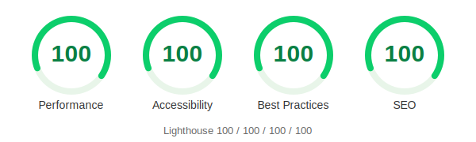

# avel

<p></p>

**The fastest-rendering [Zola](https://www.getzola.org/) blog theme.** A homage to the legendary [Abe Hiroshi's homepage](http://abehiroshi.la.coocan.jp/) — the page that renders before you blink — rebuilt as a modern, responsive, fully customizable theme.

- **Instant display** — pure HTML streamed top-to-bottom; the first characters paint immediately, nothing waits on a wrapper to finish loading
- **Instant navigation** — internal links are prerendered on hover (Speculation Rules) and cross-faded with CSS View Transitions; clicking feels like ~0ms
- **No runtime JavaScript, zero external resources** by default (no web fonts, no CDN; the only `<script>` is a declarative Speculation Rules hint, which you can switch off)
- **Inline critical CSS** — no render-blocking external stylesheet request
- **`content-visibility` for off-screen content** — long lists/articles skip rendering until scrolled into view, while on-screen text still paints instantly
- **Responsive** — Abe's site isn't; avel is (one CSS media query, no JS)
- **Lazy-loaded content images**, eager LCP image with `fetchpriority`
- **Fully customizable** via `config.toml` — defaults recreate the Abe look, every knob is overridable, no HTML/CSS editing needed

## Demo

[avel.llll-ll.com](https://avel.llll-ll.com)

## Installation

```bash
cd your-zola-site
git submodule add https://github.com/kako-jun/avel themes/avel
```

Set in `config.toml`:

```toml
theme = "avel"
```

## Configuration

All style options are controlled via `[extra]` in `config.toml`. Copy and uncomment what you need:

All defaults recreate the Abe Hiroshi look. Uncomment any line to override it.

```toml
[extra]
# --- Profile (shown centered in the top-page content, like Abe's right frame — not in the sidebar) ---
# name = "Your Name"
# profile_image = "me.webp"       # place in static/
# profile_text = "one-line bio"   # optional, under the name

# --- Background ---
# background_image = "bg.svg"     # place in static/
# body_bg = "#ffffff"

# --- Layout ---
# nav_width = "18%"               # default: 18% (Abe's frameset is cols=18,82)
# nav_bg = "#f0f0ff"              # default: #f0f0ff (pale lavender)
# nav_border = true               # default: true (right divider, a nod to the old frame border)
# nav_item_gap = ".9em"           # default: .9em
# nav_bullet = "●"                # default: ● (set "" to remove)
# nav_bullet_colors = ["#ffcccc","#00ff00","#33ffff","#0099ff","#0000ff","#333399","#cc00cc"]  # default: Abe's 7-color cycle
# main_padding = "1em"
# max_width = "960px"
# content_align = "left"         # left / center / justify
# title_align = "center"          # page <h1> alignment, default: center
# line_height = "1.5"            # default: 1.5

# --- Font ---
# font = "serif"                  # serif / sans-serif / monospace, default: serif (Abe renders in the browser default serif)
# font_family = "Georgia"         # system fonts only = no external requests
# google_fonts_url = "https://fonts.googleapis.com/css2?family=Noto+Serif+JP&display=swap"
# font_size = "16px"              # default: 16px (browser default)

# --- Colors ---
# text_color = "#000000"          # default: black
# link_color = "#0000ee"          # default: browser-default blue
# link_visited = "#551a8b"

# --- Speed (modern, on by default — keeps Lighthouse 100) ---
# view_transitions = true         # CSS cross-document fade between pages (no JS)
# speculation_rules = true        # prerender internal links on hover for ~0ms navigation (one declarative <script>; external links and /atom.xml excluded)

# --- Date ---
# date_format = "%Y-%m-%d"        # e.g. "%Y年%m月%d日"

# --- Footer ---
# footer = "© Your Name"

# --- OGP ---
# og_image = "og.webp"            # place in static/

# --- Navigation ---
# nav = [
#   { label = "Home", url = "/" },
#   { label = "Posts", url = "/posts/" },
# ]
```

## Content structure

```
content/
  _index.md              # top page
  posts/
    _index.md            # posts section (sort_by = "date", transparent = true, paginate_by = 10)
    my-post.md           # a post
```

`transparent = true` in `posts/_index.md` makes posts visible in the top page list.

## Tags

Add `[[taxonomies]]` to `config.toml`:

```toml
[[taxonomies]]
name = "tags"
url = "tags"
feed = false
lang = "en"
```

Then add tags to your posts:

```toml
+++
title = "My Post"
date = 2026-01-01

[taxonomies]
tags = ["foo", "bar"]
+++
```

Tag pages are generated at `/tags/` and `/tags/{name}/`.

## Theme gallery

This theme is listed on [getzola.org/themes](https://www.getzola.org/themes/).
GitHub topic: [`zola-theme`](https://github.com/topics/zola-theme)

## License

MIT
